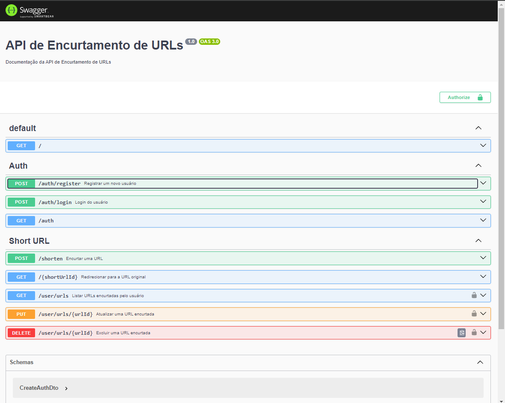
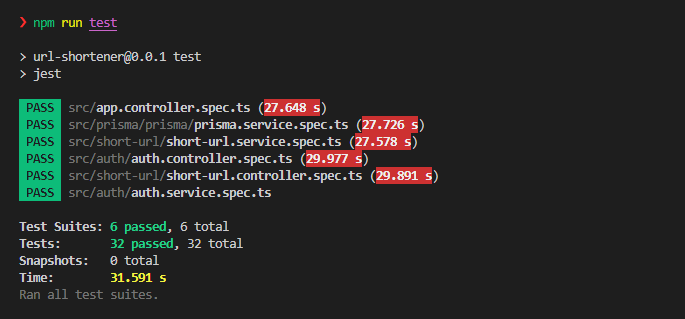
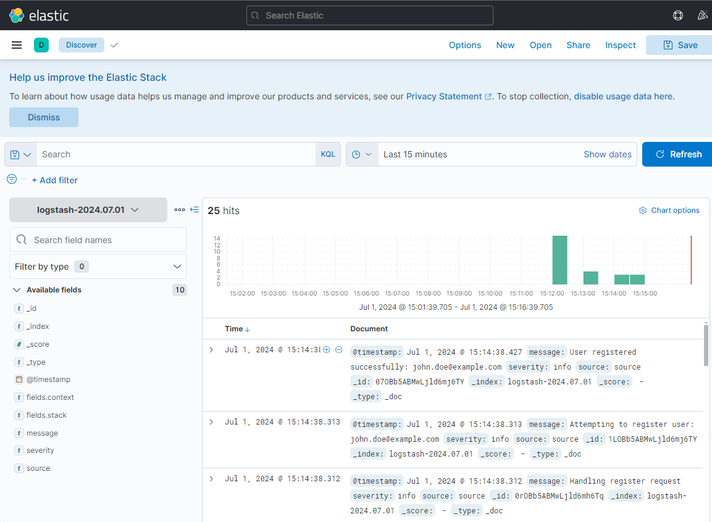
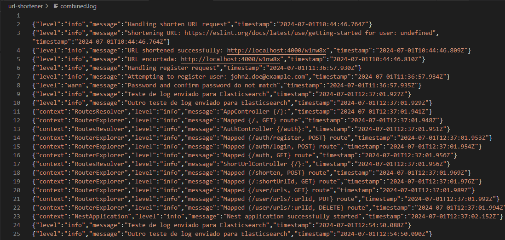

# URL Shortener


## Descrição

Este é um aplicativo de encurtamento de URLs desenvolvido com NodeJS e NestJS. O sistema inclui autenticação de usuários, contagem de cliques em URLs encurtadas, redirecionamento com contabilização de acessos, e funcionalidades avançadas como exclusão lógica de registros. Utilizamos Docker para conteinerização e Prisma como ORM para interação com o banco de dados e visualização de log no elasticsearch.


## Funcionalidades

- Registrar e autenticar usuários
- Encurtar URLs
- Redirecionar URLs encurtadas para a URL original
- Contabilizar cliques em URLs encurtadas
- Listar, atualizar e excluir URLs encurtadas por usuários autenticados

## Tecnologias Utilizadas

- NodeJS
- NestJS
- Prisma
- Docker
- MySQL
- Elasticsearch
- Kibana
- JWT para autenticação

## Requisitos para rodar o sistema

- Docker e Docker Compose instalados
- NodeJS e npm instalados

## Configuração do Ambiente

### Variáveis de Ambiente
Crie um arquivo `.env` na raiz da pasta url-shortener e adicione as seguintes variáveis de ambiente segundo o .env.example

````bash

# Configuração do Banco de Dados
DATABASE_URL="mysql://DATABASE_USERNAME:DATABASE_PASSWORD@db:3306/DATABASE_NAME"
DATABASE_PASSWORD=db_example_password
DATABASE_NAME=db_example_name
DATABASE_USERNAME=db_example_user

# Configuração do Elasticsearch
ELASTICSEARCH_URL=http://elasticsearch:9200

# Configuração do JWT
JWT_SECRET=seu_token

# URL Base da Aplicação
BASE_URL=http://localhost:4000

````

### Configuração do Docker Compose:

Certifique-se de que os serviços elasticsearch e kibana estejam configurados no docker-compose.yml assim que o DATABASE_URL

### Instruções de Instalação

1. Clone o repositório:

````bash

git clone https://github.com/maxfortune93/teddy_shortener_challenge.git

````

2. Instale as dependências:

Rodar o command do docker compose dentro da pasta raiz.

````bash

docker compose up --build

````

Depois o sistema subir, executar em um outro terminal

````bash
- Primeiro, entrar no contêiner:

docker compose exec url-shortener bash

- Em seguida, executar as migrações:

npx prisma migrate dev --name init

````

### Pode levar alguns minutos pra levantar o sistema toda !!!

Ao executar docker-compose up, o Docker Compose fará o seguinte:

1. Construirá as imagens necessárias para url-shortener e prisma usando os Dockerfiles especificados.

2. Iniciará os contêineres dos serviços na ordem definida por depends_on.

3. Configurará as conexões entre os serviços usando as variáveis de ambiente e links.

4. Mapeia as portas especificadas dos contêineres para o host, permitindo o acesso aos serviços externamente.

4. Utilizará volumes para garantir que os dados dos serviços sejam persistidos entre reinicializações.


## Projeto Executando

O servidor estará disponível em http://localhost:4000.

## Documentação da API

A documentação da API é gerada automaticamente com Swagger e pode ser acessada em http://localhost:4000/api.



## Testes Unitários

Para executar os testes unitários:

````bash

cd url-shortener // Para ir entrar na pasta url-shortener
npm run test

````



## Visualização de Logs com Kibana

1. Acessando o Kibana:

    * Acesse o Kibana através do endereço http://localhost:5601.

2. Configurando o Índice de Logs:

    * No Kibana, vá para "Stack Management" > "Kibana" > "Index Patterns".

    * Clique em "Create index pattern".

    * Defina o padrão de índice como logstash-* e siga as instruções para criar o índice.

3. Explorando os Logs:

    * Utilize as ferramentas de "Discover", "Visualize" e "Dashboard" no Kibana para explorar e criar visualizações dos seus dados de log.



## Visualização de Logs em json.

  Tem um aquivo *combined.log* que é gerado para visualização de log.



## Sugestões de Possíveis melhorias

1. Implementação de Cache com Redis

Para melhorar o desempenho do sistema, podemos utilizar o Redis para cachear respostas de consultas frequentes. Isso reduzirá o tempo de resposta para essas consultas e diminuirá a carga no banco de dados.

2. Observabilidade de Métricas

Otimizar as métricas do sistema para visualizar dados em tempo real. Isso nos permitirá identificar e resolver problemas rapidamente, além de otimizar o desempenho do sistema.

3. Testes de Integração Ponta a Ponta

Para garantir a robustez e a confiabilidade do sistema, podemos implementar testes de integração ponta a ponta utilizando Jest e Supertest. Esses testes simulam cenários reais de uso e verificam se todos os componentes do sistema funcionam corretamente juntos.

4. Arquitetura de Microserviços e API Gateway

Migrar para uma arquitetura de microserviços para melhorar a escalabilidade e a manutenção do sistema. Um API Gateway pode ser utilizado para gerenciar as requisições e rotear para os microserviços apropriados, garantindo uma comunicação eficiente entre os diferentes serviços.

5. Listagem com Paginação e Filtro

Para melhorar a experiência do usuário e a performance do sistema, podemos implementar funcionalidades de paginação e filtros nas listagens de dados. Isso permitirá que os usuários naveguem mais facilmente pelos dados e reduzirá a carga no servidor ao limitar a quantidade de dados processados em cada requisição.


## License

[MIT licensed](LICENSE).
